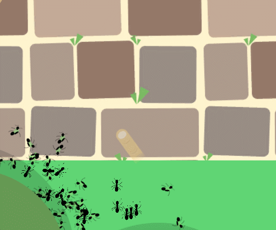

# I hate ants.
(And love cake.)

### Created for Ludum Dare 50 as a Compo entry
[https://ldjam.com/events/ludum-dare/50/i-hate-ants](https://ldjam.com/events/ludum-dare/50/i-hate-ants)

I hate ants. (🐜🚫) is a strategy survival game where you try to keep a cake safe from invading ants.

## Controls:
🖱️ Right Click + Drag to move the camera
🖱️ Left Click to interact (destroy ants)
🖱️ Scroll wheel to zoom in & out

☝️ Finger: Click to crush ants under your cursor.

🔫 Hairspray: Click to spray & ignite ants with a hairspray can. Will have to recharge after use.

🪤 Trap: You can unlock & place three traps in total. Each trap can block a potential path to the cake, as ants will avoid entering its radius. It will also kill any non-supermajor ants that do enter.

## Features:
- Different "weapons" that get unlocked the further you progress.
- Different ant types that you will have to tackle.
- Score to compete with your friends and other developers in the comments. 🙂

## Ants
- Normal: A basic ant, has 1 health point. Gets crushed easily.
- Brood carrying ant: Carries a brood. Can start a new nest that will spawn extra ants for the rest of the game.
- Supermajor: Has a large head. Is not effected by traps, and has 3 health points!

Thanks a lot for playing & rating. 🙂 All feedback is greatly appreciated!
